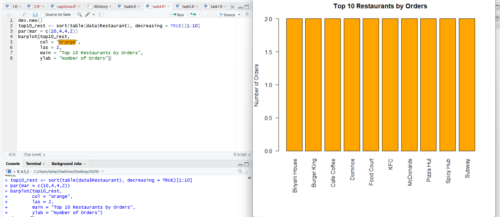
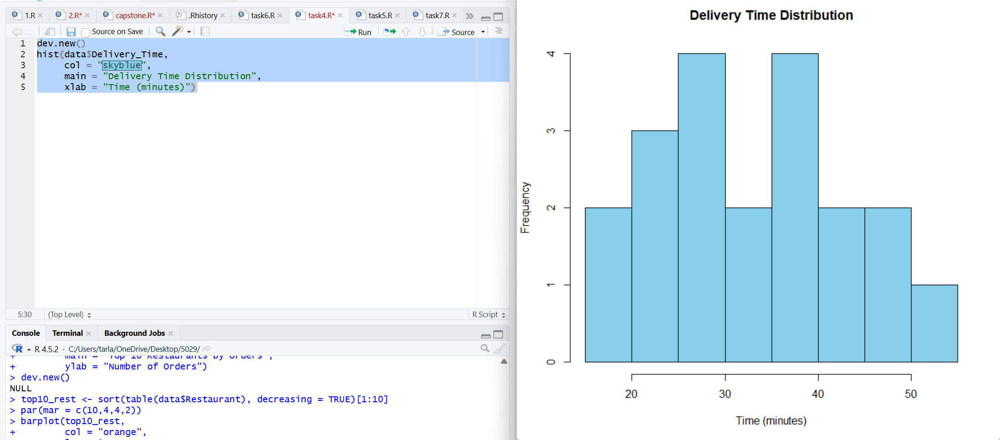
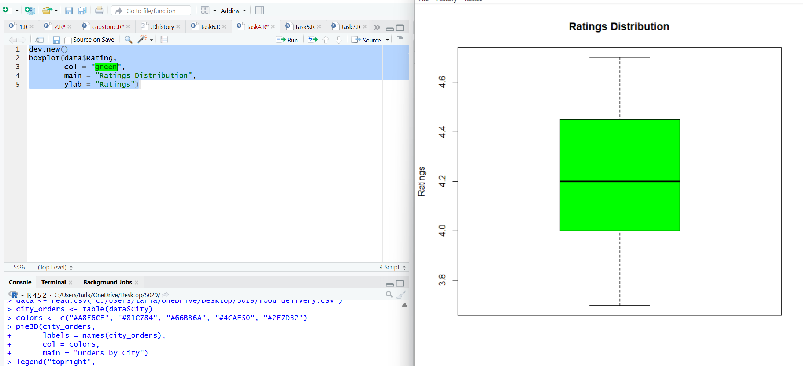
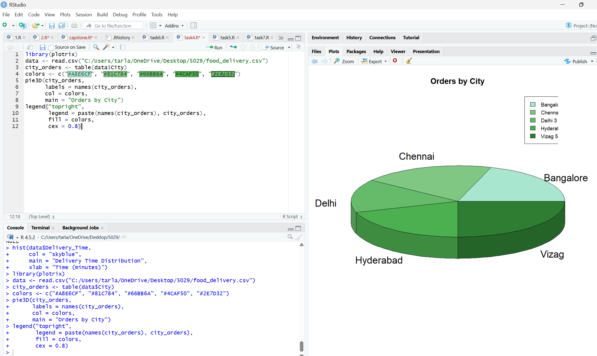
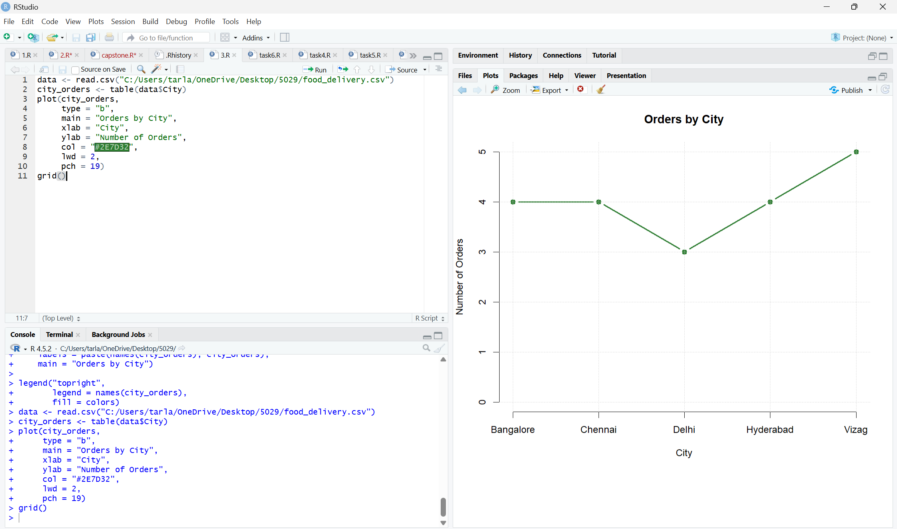
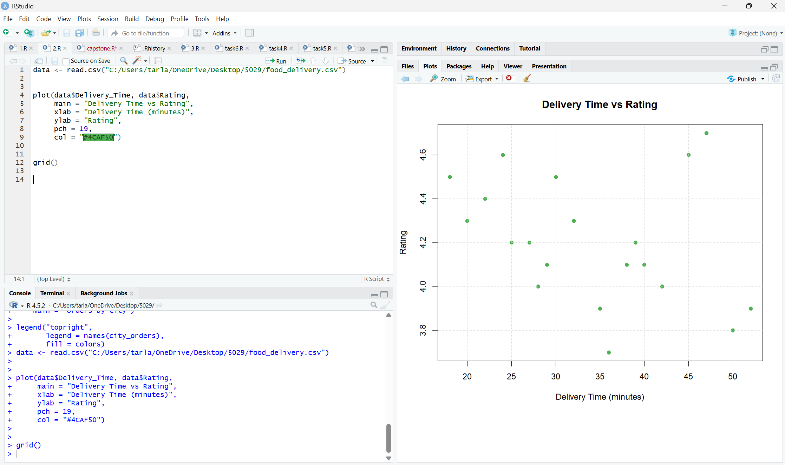

# 🍔 Food Delivery Data Analysis using R

## Overview
This project performs an in-depth Exploratory Data Analysis (EDA) on a real-world Food Delivery dataset using R Programming. The goal is to extract meaningful insights about delivery efficiency, customer satisfaction, restaurant performance, and regional order trends. This analysis helps understand what factors influence delivery time and customer ratings in the food delivery industry.

## Technologies Used
- R Programming
- RStudio IDE
- ggplot2 — Data Visualization
- dplyr — Data Manipulation

## Dataset
- Source: Custom dataset (CSV file included in the repository)
- File: food_delivery.csv
- Contains:
  - Restaurant names and details
  - Delivery time per order
  - Customer ratings
  - City-wise order information
  - Order statistics and trends

## How to Run
1. Clone or download this repository
2. Open the .R file in RStudio
3. Install required packages by running:
   install.packages(c("ggplot2", "dplyr"))
4. Load the dataset food_delivery.csv
5. Run the script to generate all plots and analysis

## Analysis Highlights
- Identified the Top restaurants based on total number of orders
- Analyzed delivery time distribution to understand average and peak delivery durations
- Explored customer ratings to measure overall satisfaction levels
- Compared city-wise order volume to identify high-demand regions
- Investigated the relationship between delivery time and customer ratings

## Key Insights
- Restaurants with faster delivery times tend to receive higher customer ratings
- A few cities contribute to the majority of total orders
- Most deliveries fall within an average time range showing operational consistency
- Customer ratings are closely linked to delivery speed and restaurant quality

## Screenshots

### Top Restaurants Analysis

### Delivery Time Distribution

### Ratings Distribution

### Orders by City Piechart

### Orders by City Plot

### Delivery Time vs Rating

## Project Report
The complete project report including R code, visualizations, and detailed analysis is available in:
R_capstone_varshini.pdf

## Learning Outcomes
- Performed end-to-end Exploratory Data Analysis using R
- Built meaningful visualizations using ggplot2
- Derived actionable insights from real-world data
- Strengthened understanding of statistical analysis and data storytelling

## Author
Tarlana Varshini
B.Tech Student | Aspiring Data Analyst
